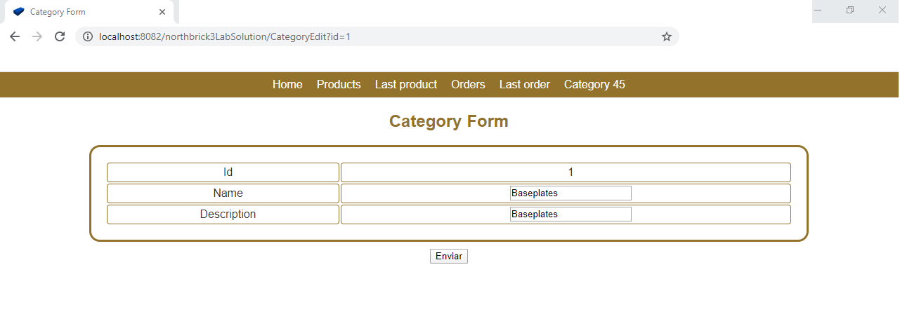
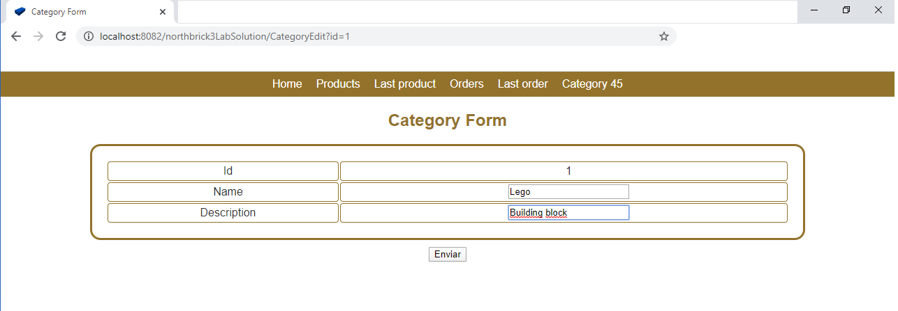
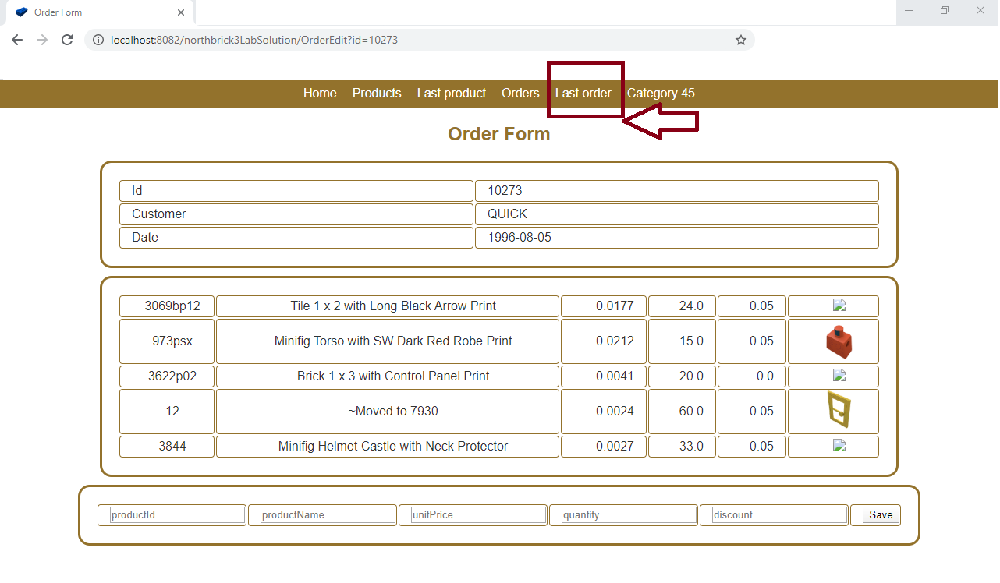
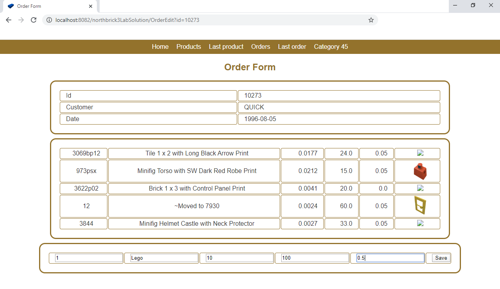
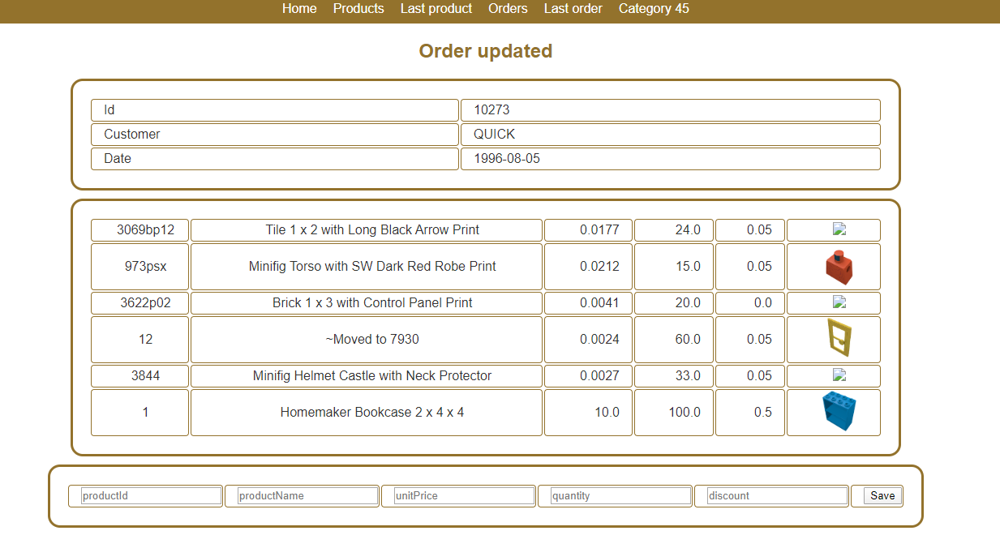

# Lab Exercises in Northbrick3

# Northbrick application

Install the northbrick application from the files in the folder: 
[https://github.com/nicolasserrano/CS/tree/master/webapps/northbrick3](https://github.com/nicolasserrano/CS/tree/master/webapps/northbrick3)

# Product edition
We want to include further information in the  ProductEdit Servlet such as :  CategoryId, QuantityPerUnit, UnitsInStock and UnitsOnOrder. To do so, you should include these fields as attributes in ProductData class, in addition to add a new constructor and a new method to get this information from the database. 
Once you have made changes in this class, you should make changes in ProductEdit servlet so that you can show in the table the new fields: CategoryId, QuantityPerUnit, UnitsInStock and UnitsOnOrder.

If you want to update some of these values in the database, you will develop a new method to update the database in the ProductDAta class and this new method will be used in in the servlet ProductUpdate.java.

In this link, you will find an explanation of the solution to this exercise. [Exercise Solution](https://josuneha.github.io/SoftEng/Ex1Explanation)

# Category list

Create a Servlet that lists all the categories from the table Categories. The following figure shows the format of this table and the fields you need to show. In addition to the fields from the Categories table in the database, each category row will also have a link to this existing servlet, where the categoryId field is the id of the category.

http://localhost:8080/northbrick3/ProductList?id=categoryId 

To test this servlet, you will type in the browser: http://localhost:8082/northbrick3/CategoryList

When you click on the link of Products of category with id=4, you will get the list of products included in that category, as you can see in the following figure.

# Category edition
You should develop the servlets to edit an existing category. To do so, add a new column in the table when you list the categories to be able to edit an existing category. 

When you select one category and click on Edit link, you should show a table with the information of the selected Category. The following figure shows the information of Category with id=1. 
In this table, you should be able to change the Name and Description fields and update them in the database when you click on Enviar button. 

# Order creation

Develop the servlets you think are needed to add a new product to an existing order. 
You can click on the menu Last Order on the top of the page to show the order with id=10273. 

When the information of an order is shown, we should also include a table with a row just to insert the new product in that order. This 
table will include the following fields: productId, productName, unitPrice, quantity and discount. This table will also include a button to Save this information in the database. 

IMPORTANT: The information of the productName field is not sent to the database, so it will not be saved in the database but we will keep it to use it when you learn how to use Ajax. 
- The discount field needs a value between 0 an 1.

If you want to add new products to another order, you should type the following text changing the id of the order you want to change. 
http://localhost:8082/northbrick3LabSolution/OrderEdit?id=10483

Once we have inserted the new product, this product will appear in the table as it is shown in the next figure. Please, remember that we are not still saving the ProductName in the database. You will do it using Ajax in next lessons. 

© 2020 GitHub, Inc.
