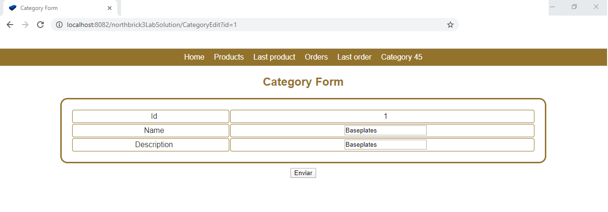
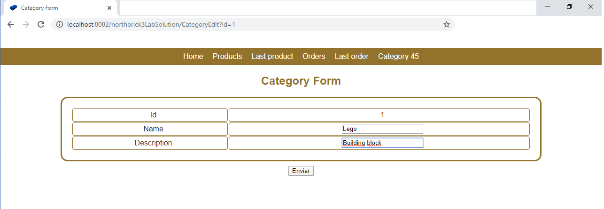

# Lab Exercises in Northbrick3

# Northbrick application

Install the northbrick application from the files in the folder: 
[https://github.com/nicolasserrano/CS/tree/master/webapps/northbrick3](https://github.com/nicolasserrano/CS/tree/master/webapps/northbrick3)

# Product edition
We want to include further information in the  ProductEdit Servlet such as :  CategoryId, QuantityPerUnit, UnitsInStock and UnitsOnOrder. To do so, you should include these fields as attributes in ProductData class, in addition to add a new constructor and a new method to get this information from the database. 
Once you have made changes in this class, you should make changes in ProductEdit servlet so that you can show in the table the new fields: CategoryId, QuantityPerUnit, UnitsInStock and UnitsOnOrder.

If you want to update some of these values in the database, you will develop a new method to update the database in the ProductDAta class and this new method will be used in in the servlet ProductUpdate.java.

In this link, you will find an explanation of the solution to this exercise. [Exercise Solution](https://josuneha.github.io/SoftEng/Ex1Explanation)

# Category list
You can look at this file to have more details about how to solve the exercise: [StepsToSolveExercise](https://josuneha.github.io/SoftEng/northbrickApp.pdf)
First, you should create a Servlet that lists all the categories from the table Categories. The following figure shows the format of this table and the fields you need to show. 
To test this servlet, you will type in the browser: 

http://localhost:8082/northbrick3/CategoryList

Once you can see the category list, add a 'Products' column containing a link to the existing ProductList servlet. Ensure the link passes the **categoryId** as a parameter so the servlet can retrieve and display only the relevant products from the database.

The url you will see when you click on the Products link should be: 

http://localhost:8080/northbrick3/ProductList?id=categoryId 

When you click on the link of Products of category with id=4, you will get the list of products included in that category, as you can see in the following figure.

# Category edition

You should develop the servlet to edit an existing category (**CategoryEdit**). To do so, add a new column in the table when you list the categories to be able to edit an existing category. 

When you select one category and click on Edit link, you should show a table with the information of the selected Category. The following figure shows the information of Category with id=1. 
In this table, you should be able to change the Name and Description fields and update them in the database when you click on Enviar button. 

The information you will send to the database to be updated must be included in a form as it follows: 

`<form action='CategoryUpdate' method='GET'>`

The action attribute in an HTML form is a parameter that defines where form data should be sent after a user submits it. In this case, we will develop a servlet called **CategoryUpdate** that will read the information from the url using **getParameter** function and will update the information in the database. 

